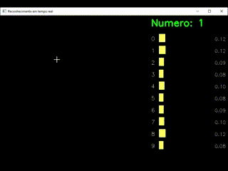

# 🧠 Number Recognition with CNN

Este projeto utiliza uma rede neural convolucional (CNN), construída com TensorFlow e treinada com o conjunto de dados MNIST, para reconhecer números escritos à mão a partir de imagens externas. Também integra o OpenCV para pré-processamento de imagens.

---

## 📸 Demonstração

<p align="center">
  
</p>

---

## ⚙️ Tecnologias utilizadas

- 🧠 [TensorFlow](https://www.tensorflow.org/) — para construir e treinar a CNN
- 👁 [OpenCV](https://opencv.org/) — para capturar e processar imagens
- 🐍 Python — linguagem principal

## 🚀 Como usar

### 1. Instalar dependências

```bash
pip install -r requirements.txt
```

